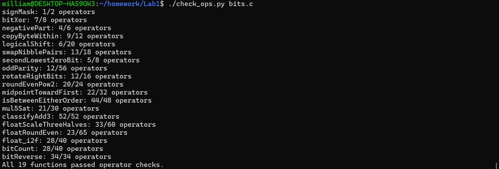
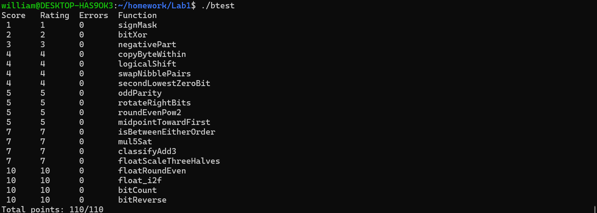

Lab1实验报告
姓名：夏辰昕
学号：25301020126

1. 操作符检查
在终端中执行 ./check_ops.py bits.c，结果如下：

2. 功能测试
在终端中执行 ./btest，结果如下：

3. 函数实现思路
P1 signMask
利用左移运算 1 << 31 得到最高位为 1、其余位为 0 的掩码，即 0x80000000。

P2 bitXor
仅使用 ~ 和 & 实现异或。根据德摩根律：
x ^ y = ~(~(x & ~y) & ~(~x & y))。

P3 negativePart
若 x < 0，返回 -x，否则返回 0。
先取符号位 x >> 31（负数得全 1，非负得 0），再与 ~x + 1（即 -x）按位与。

P4 copyByteWithin
将 x 的第 src 个字节复制到第 dst 个字节。
先取出源字节 (x >> (src*8)) & 0xFF，再清除目标字节位置，最后将源字节左移到目标位置并合并。

P5 logicalShift
逻辑右移需要将算术右移产生的高位符号位清零。
先构造掩码 ~(((1 << 31) >> n) << 1)，再与 x >> n 按位与。

P6 swapNibblePairs
交换每个字节内的高 4 位和低 4 位。
用掩码 0x0F0F0F0F 取出所有低 4 位并左移 4 位，同时将 x 右移 4 位后与掩码按位与，最后合并。

P7 secondLowestZeroBit
返回第二个最低的 0 位对应的掩码。
令 y = x | (x + 1)，这样最低的连续 1 变为 0，最低的 0 变为 1。
第二个 0 位的位置即为 ~y & (y + 1)。

P8 oddParity
计算 x 中 1 的个数的奇偶性，偶数个 1 返回 1，奇数个 1 返回 0。
采用折叠法：依次异或右移 16、8、4、2、1 位，最后取最低位并取反。

P9 rotateRightBits
循环右移 n 位。
先对 n 取模 32（n & 31），然后 (x >> n) | (x << (32 - n))。
其中 32 - n 用 (32 + (~n + 1)) & 31 计算。

P10 roundEvenPow2
将非负整数 x 四舍六入五成双到最近的 2^n 倍数。
先取低 n 位 r = x & ((1<<n)-1)，商 y = x >> n。
若 r 大于半值，或等于半值且 y 为奇数，则进位。
最后返回 (y + round_up) << n。

P11 midpointTowardFirst
无溢出地计算 (x+y)/2，若中点恰好为半整数，则选择靠近 x 的整数。
使用 avg = (x & y) + ((x ^ y) >> 1) 避免溢出。
判断奇偶和符号，若 x > y 且中点有半位，则加 1。

P12 isBetweenEitherOrder
判断 x 是否在 a 和 b 构成的闭区间内（端点顺序任意）。
先比较 a、b 得到 min 和 max，再判断 x >= min && x <= max。
比较使用位运算实现，避免减法溢出。

P13 mul5Sat
计算 x * 5，若溢出则饱和到 INT_MAX 或 INT_MIN。
先计算 result = (x << 2) + x。
正数阈值 0x1999999A，负数阈值 -0x19999999。
判断是否超过阈值，若正溢出返回 INT_MAX，负溢出返回 INT_MIN。

P14 classifyAdd3
判断 x + y + z 的精确数学和是否超出 int 范围。
分别计算两步加法的进位和符号位数，得到总进位 C 和负数个数 neg_count。
令 D = C + neg_count，根据 D 的值和最终和的符号判断溢出方向。
返回 1 表示上溢，-1 表示下溢，0 表示未溢出。

P15 floatScaleThreeHalves
计算浮点数 f * 3/2。
分离符号、阶码和尾数。处理 NaN/Inf、非规格化数、规格化数。
对规格化数，将尾数乘以 3，再根据最高位调整阶码，最后进行舍入到最近偶数。

P16 floatRoundEven
将浮点数舍入到最近的整数，半整数舍入到偶数。
若 NaN/Inf 直接返回。若阶码较大（≥150）已是整数，直接返回。
否则提取有效数字，右移相应位数，根据舍入规则决定是否进位。
若结果为 0，保留原符号（-0）。最后将整数重新编码为浮点数。

P17 float_i2f
将整数 x 转换为单精度浮点数。
处理 0、负数（取绝对值并设置符号位）。
找到最高有效位 k，计算阶码 127 + k。
根据 k 与 23 的关系，提取尾数并舍入到最近偶数。
若进位导致阶码增加，相应调整。

P18 bitCount
统计 x 中 1 的个数。
先取出最高位并清除，避免算术右移影响。
使用掩码 0x55555555、0x33333333、0x0F0F0F0F 进行分组加法。
最后将四个字节的计数相加，再加上之前取出的最高位。

P19 bitReverse
反转 32 位整数的所有位。
使用分治交换：先交换相邻 1 位、2 位、4 位、8 位、16 位。
掩码 m4、m2、m1、m8 通过小常量移位和异或构造，避免使用大于 0xFF 的常量。
最后将高 16 位与低 16 位交换，完成反转。

[def]: images/01.png
[def2]: images/02.png